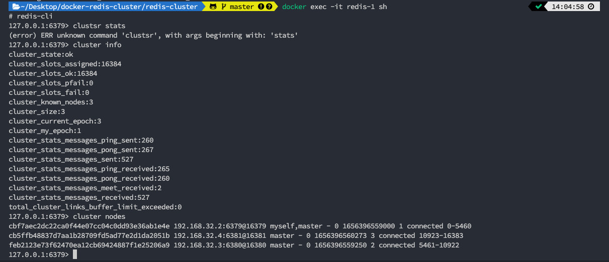

# 使用hostname 組成redis-cluster架構

## 簡介
因常使用redis測試一些架構以及參數，因此建立此repo方便之後測試需求時使用，主要為cluster架構


## quick start
```
docker-compose up -d
```

## check cluster stats
```
docker exec -it redis-1 sh

redis-cli cluster info && redis-cli cluster nodes
```
